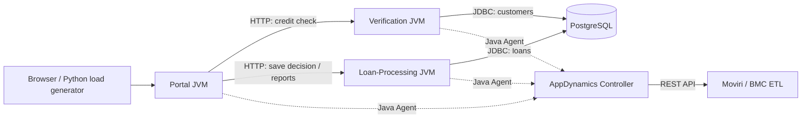

# Capital Lab for AppDynamics ETL testing

A portable financial demo that generates **real AppDynamics APM data** for the Moviri/BMC ETL connector. This is an independent implementation inspired by [AD-Capital](https://github.com/Appdynamics/AD-Capital), not a restoration of its old images. It uses Java 21, Spring Boot 3.5, PostgreSQL 17, and Docker Compose. No AppDynamics SDK is required in the application source.

The goal is to populate a Controller for the existing ETL to extract. The application is not itself an ETL engine. All customers, credit scores, and loan decisions are synthetic.



## Start locally

Requirements: Docker Desktop using Linux containers on Windows, or Docker Engine with Compose v2+ on Linux. Allow approximately 4 GB RAM for the stack plus Docker overhead; 4 vCPU / 8 GB is a comfortable lab host starting point. A JDK and Maven are installed inside the build image.

From the repository root on Windows:

```powershell
cd AppDynamics
# First run only; do not overwrite an already configured .env.
Copy-Item .env.example .env
docker compose build portal
docker compose up -d --wait
```

From the repository root on Linux:

```bash
cd AppDynamics
# First run only; do not overwrite an already configured .env.
cp .env.example .env
docker compose build portal
docker compose up -d --wait
```

Open **http://localhost:8088**. The demo runs immediately with the default configuration; connect an AppDynamics account using the next section. Only the portal is published, on loopback by default. The database and internal service endpoints stay within the Compose network. This lab has no user authentication; use an SSH tunnel for remote access.

## Connect AppDynamics

1. In the Controller's Java Getting Started wizard, select **JDK8+**, application **Capital-Lab**, and tier **Portal**, then download its configured Java Agent ZIP. Use the full agent distribution; the launcher requires `javaagent.jar` at the distribution root.
2. Import it with Python 3.10+ (Python is only needed locally for this optional helper):

   ```powershell
   python scripts/configure-agent.py "$env:USERPROFILE\Downloads\AppServerAgent-1.8-26.7.0.38091.zip"
   ```

   The helper extracts the agent into `agents/java` and imports the Controller connection settings into `.env`, preserving other settings. It does not print the access key. A different filename can be supplied. If you already extracted the agent manually, populate `.env` from the example instead.

3. Restart and generate traffic:

   ```powershell
   docker compose up -d --wait
   docker compose --profile load up -d loadgen
   docker compose logs -f loadgen
   ```

Expected application: **Capital-Lab**; tiers: **Portal**, **Verification**, **Loan-Processing**. Each JVM gets a node name containing its role and container hostname. Nodes survive ordinary container restarts; recreating a container creates a new node identity, useful for testing discovery. All JVMs use one `APPDYNAMICS_AGENT_UNIQUE_HOST_ID` for their Docker host. Assign a different ID in Boston.

The agent is mounted read-only; its runtime files and logs are written to `/tmp/appdynamics` inside each Java container. Agent binaries and `.env` are excluded from Git and the image build context. The downloaded ZIP and extracted `controller-info.xml` also contain trial configuration, so keep them private. The image contains no trial credentials. Avoid sharing output from `docker compose config` or `docker inspect`, since those can include secrets. `docker compose config --quiet` validates without printing them.

The launcher requires complete connection settings when `APPDYNAMICS_ENABLED=true` and enforces certificate validation. With `false`, the same image runs without an agent. Allow a few minutes for discovery and metric reporting; validate in the Controller before testing the ETL.

## Workflows and fault scenarios

| Request / scenario | Behavior | What to inspect in AppDynamics |
|---|---|---|
| `POST /api/loans/apply`, `NORMAL` | Portal calls Verification, then Loan-Processing; decision is saved | Calls, response time, HTTP correlation, JDBC backend |
| Customer 10 / customer 1 | Deterministic approval / decline, both HTTP 200 | Business declines do not inflate technical error counts |
| `SLOW` | Verification waits 2 seconds | Tier and transaction latency |
| `SQL_SLOW` | PostgreSQL runs `pg_sleep(1.5)` through JDBC | Database backend time and slow snapshots |
| `ERROR` | Verification throws; portal returns HTTP 500 | Errors per minute and error snapshots |
| `CPU` | Verification computes SHA-256 for about 300 ms | CPU pressure, latency and JVM activity |
| `GET /api/loans/recent` | Read latest 30 decisions | Read transaction / JDBC activity |
| `GET /api/reports/portfolio` | Aggregate saved loan decisions | Reporting transaction / SQL activity |

Requests contain `requestId` (UUID), `customerId` (1–100), `amount` (100–100000, at most two decimal places), `termMonths` (12–84), and `scenario`. Retrying an identical request is idempotent; reusing its UUID for a different loan returns HTTP 409. Invalid input returns HTTP 400. Set `DEMO_FAILURES_ENABLED=false` and `LOAD_PATTERN=normal` if you only want healthy traffic.

The default generator cycles every five minutes through **normal → peak → slow → errors → recovery**, repeating every 25 minutes. It targets 2 requests/sec normally and 6 at peak, with at most 8 concurrent requests. About 75% of calls are loan submissions; the rest are reads. It skips scheduled requests when concurrency is full instead of building an unbounded queue. Logs distinguish HTTP responses, network errors and capacity skips; actual throughput is not guaranteed.

Tune `LOAD_RPS`, `LOAD_WORKERS`, `LOAD_PHASE_SECONDS` and `LOAD_PATTERN` in `.env`, then recreate the generator. Valid fixed patterns are `normal`, `peak`, `slow`, `errors`, `recovery`, and `cpu`. Keep each phase long enough to span multiple Controller/ETL sample intervals. The default runs until stopped; for a finite job:

```powershell
docker compose --profile load run --rm -e LOAD_PATTERN=normal -e LOAD_DURATION_SECONDS=120 loadgen
```

Do not run a finite job alongside the persistent generator unless additive load is intended.

## Verify the demo

The integration check exercises all three services and the actual PostgreSQL database. Run it with the load generator stopped and no concurrent browser submissions; it asserts aggregate counts:

```powershell
docker compose --profile load stop loadgen
docker compose --profile test run --rm smoke
```

Alternatively, with Python installed: `python scripts/smoke.py`. The suite checks approvals, declines, money precision, sequential and concurrent retries, conflicting IDs, invalid input, failure propagation, slow requests, slow SQL, CPU work, and portfolio counts. It adds five synthetic loans and is safe to rerun without deleting existing data.

## Moviri / BMC ETL validation

The local connector's `MatchAndGap.java` maps calls to `TOTAL_EVENTS`, response time to `EVENT_RESPONSE_TIME` (milliseconds converted to seconds), and errors to `TOTAL_ERRORS`. Its API client also requests tier/node metrics under the paths below. This lab is designed to exercise those existing paths without modifying the connector.

| Data to verify | Controller metric path / prerequisite |
|---|---|
| Application performance | `Overall Application Performance\|Calls per Minute`, `Average Response Time (ms)`, `Errors per Minute` |
| Tier performance | `Overall Application Performance\|<tier>\|<metric>` |
| Node performance | `Overall Application Performance\|<tier>\|Individual Nodes\|<node>\|<metric>` |
| Business transaction performance | `Business Transaction Performance\|Business Transactions\|<tier>\|<transaction>\|<metric>` |
| JVM heap / threads | `Application Infrastructure Performance\|<tier>\|Individual Nodes\|<node>\|JVM\|...` |
| Host CPU / memory / disk / network | Matching **Machine Agent**; see [Linux deployment](docs/linux-deployment.md) |
| Database server metrics | Separate **Database Agent/collector** and applicable entitlement; a JDBC backend alone does not provide these |

1. Keep traffic running for at least 30–60 minutes and record the workload phase times from generator logs in UTC or align their elapsed times with the container start time.
2. Confirm the three tiers, their nodes, HTTP edges, JDBC backend, and nonempty metric samples in the Controller. Exclude `/health` and static assets from business-transaction discovery if they clutter the view. In **Business Transactions → Configure → Java Auto Discovery Rule → Rule Configuration → Servlet → Configure Naming**, select **Use the full URI**. This separates `/api/loans/apply`, `/api/loans/recent`, and `/api/reports/portfolio`; all are stable paths. This setting was saved in the initial trial application. Historical transactions created under the former two-segment rule remain in the Controller until its normal retention/cleanup processes apply.
3. Run the existing ETL against this trial with application filtering set to `Capital-Lab`, using a time interval containing reported samples. The **agent account access key is not the ETL's API credential**; use the connector's supported Controller API user or OAuth client configuration.
4. Compare discovered application/tier/node/transaction relationships and event/latency/error trends against the Controller for the same interval. A decline is not a technical error; an injected `ERROR` is. Keep rate versus count aggregation and the connector's millisecond-to-second conversion in mind.
5. Test incremental extraction and overlap behavior, then optionally scale a service and confirm new node discovery:

   ```powershell
   docker compose up -d --scale verification=2
   ```

   This adds an instrumented JVM; confirm the trial has capacity. Compose DNS load distribution is not a production load balancer, so traffic need not be split equally.

APM/JVM data works with the Java agents. Hardware, Server Visibility, Database Visibility, EUM and Transaction Analytics are separate capabilities; do not interpret their missing data as an ETL failure unless the relevant agent/collector and trial entitlement are configured. This lab does not enable Analytics or recreate AD-Capital's JMS queue workflow.

## Operate and move to Boston

See [Linux deployment](docs/linux-deployment.md) for copying the project, keeping credentials private, remote browser access and host hardware monitoring.

```powershell
docker compose ps
docker compose --profile load stop loadgen   # stop traffic, keep the application
docker compose --profile load down          # remove lab containers, preserve database volume
```

Database data survives restarts and normal `down`. Initialization SQL runs only when the database volume is first created. Changing `DB_PASSWORD` in `.env` after initialization does not change the database role's password. Take a backup and change both deliberately if needed. No cleanup command in this guide removes the database volume.

## Sources

- [Original AD-Capital](https://github.com/Appdynamics/AD-Capital): historical workflow inspiration; no original application code was copied.
- [Java supported environments](https://help.splunk.com/en/appdynamics-on-premises/application-performance-monitoring/26.3.0/install-app-server-agents/java-agent/java-supported-environments): agent/JVM/framework compatibility. Validate the exact versions in your selected agent release.
- [Java agent environment variables](https://help.splunk.com/en/appdynamics-saas/application-performance-monitoring/26.4.0/install-app-server-agents/java-agent/install-the-java-agent/install-the-java-agent-in-containers/use-a-dockerfile/set-the-java-agent-environment-variables).
- [Machine Agent installation scenarios](https://help.splunk.com/appdynamics-saas/infrastructure-visibility/25.4.0/machine-agent/install-the-machine-agent/machine-agent-installation-scenarios).

The application dependency is pinned in `pom.xml`; base image tags receive vendor updates. For an immutable lab baseline, record the pulled image digests or pin those digests before your next deployment. Rebuild and rerun the integration check when updating dependencies.
